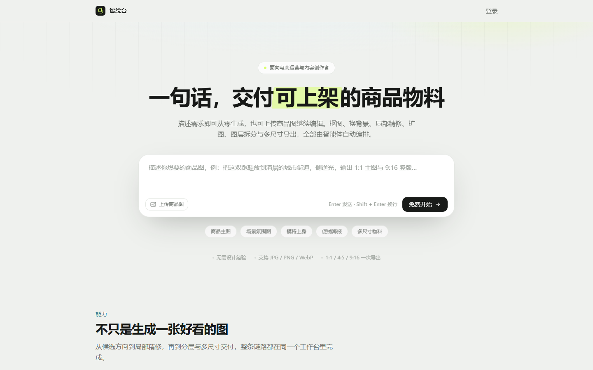
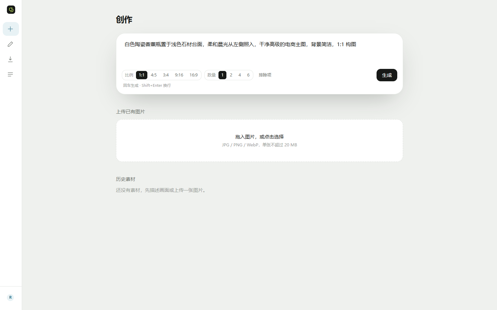
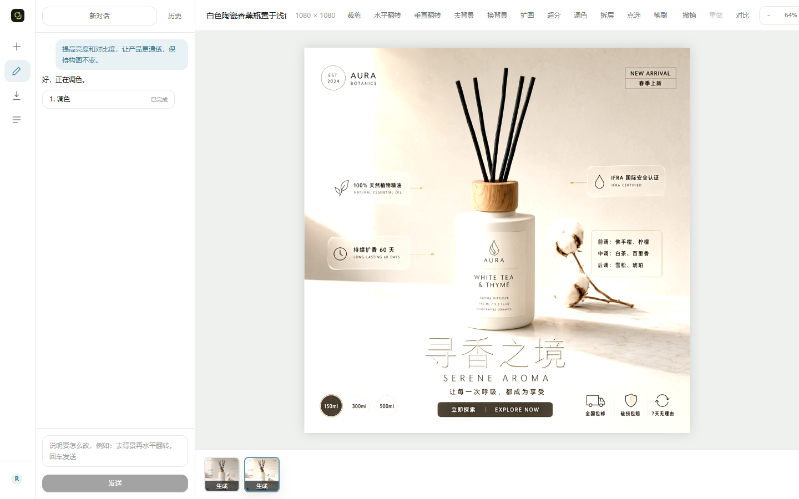
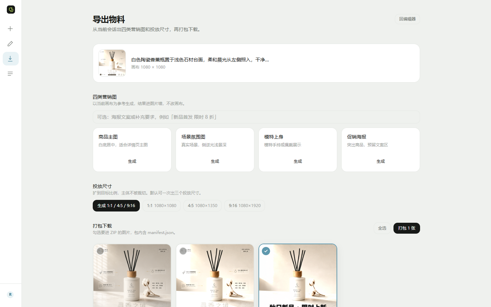
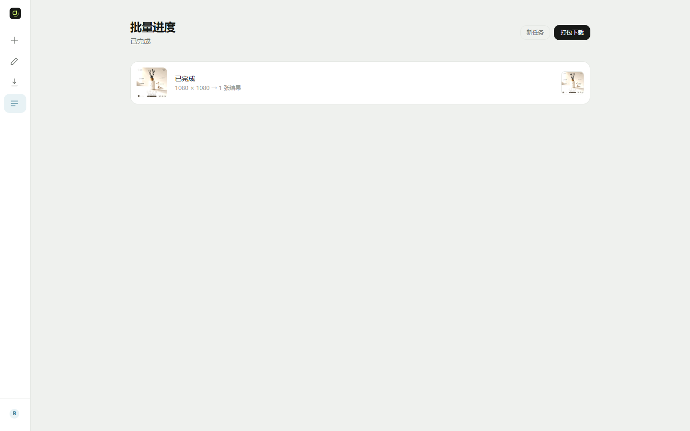
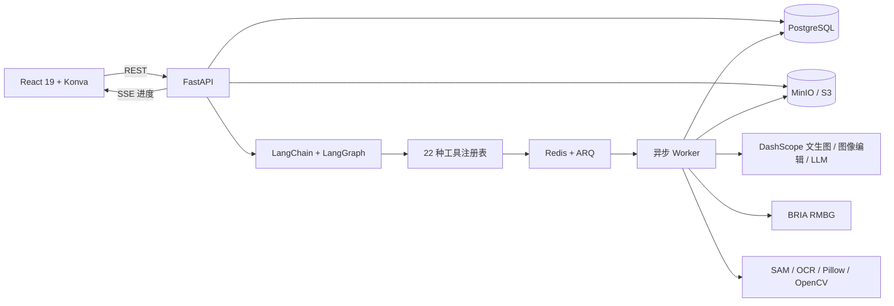

<div align="center">

# VisionDesk · 智绘台

**一句话描述需求，交付可上架的商品物料。**

基于 React 19、FastAPI、LangChain、LangGraph 与 Konva 构建的 AI 修图智能体，覆盖文生图、自然语言修图、区域编辑、图层画布、营销物料与批量交付。


</div>



## 项目简介

VisionDesk 是一个面向电商运营与内容创作者的全栈 AI 图片工作台。用户既可以从一句自然语言描述生成商品图，也可以上传已有图片继续编辑；Agent 会理解目标、生成工具计划、调度异步任务，并通过 SSE 把执行进度实时推送到界面。

它不只负责“生成一张图”，还覆盖从素材进入、候选采用、局部修图、图层处理，到营销变体、多尺寸导出和批量生产的完整链路。

### 核心能力

- **Agent 驱动**：LangGraph 负责任务规划、参数校验、多步确认、失败重试与上下文传递。
- **22 种注册工具**：工具注册表同时服务于 Agent 与界面，覆盖生成、修图、区域、图层、营销和批处理。
- **非破坏式编辑**：会话保存图层文档、历史序列和图片墙，支持撤销、重做与候选切换。
- **实时任务体验**：ARQ Worker 执行耗时任务，Redis 负责队列，SSE 持续推送阶段与进度。
- **完整交付链路**：生成营销图、适配 1:1 / 4:5 / 9:16 投放尺寸，并打包图片与 manifest。
- **容器化部署**：React 构建产物由 FastAPI 同源托管，PostgreSQL、Redis、MinIO、App 与 Worker 统一由 Docker Compose 编排。

## 真实界面与完整流程

> 下列截图来自实际运行的 VisionDesk。文生图、Agent 规划和促销海报均调用真实模型；截图不包含密钥、私人素材或真实用户信息。

### 1. 描述需求或上传图片

在创作页填写画面描述，选择比例与候选数量；也可以直接上传 JPG、PNG 或 WebP 素材进入编辑器。



### 2. 采用候选并用自然语言修图

生成任务完成后，从候选图中采用一张进入编辑器。画布、图片墙、工具栏和 Agent 对话位于同一工作区；一句“提高亮度和对比度，让产品更通透”会被规划为可执行工具步骤并实时反馈状态。



### 3. 生成营销物料

以当前画布为参考，可继续生成商品主图、场景氛围图、模特上身图和促销海报。结果进入图片墙而不覆盖当前画布，并可继续生成标准投放尺寸。



### 4. 批量处理与交付

批量任务对多张图片执行同一条处理流水线，支持去背景、换背景、调色、超分、扩图和多尺寸交付；完成后可统一打包下载。



## 22 种工具

| 能力组 | 工具 |
| --- | --- |
| 生成与增强 | 文生图、换背景、扩图、超分、去背景、调色 |
| 区域与拆层 | 擦除区域、替换区域、图层拆分、提升对象为图层 |
| 营销与批量 | 营销图生成、投放尺寸、批量处理 |
| 画布与图层 | 裁剪、翻转、透明度、显示/隐藏、文字修改、重排、缩放、旋转、移动 |

工具定义集中在 `backend/app/tools/`，并通过统一注册表向 Agent 暴露；新增工具只需实现规范并登记，即可参与计划生成与运行时调度。

## 系统架构



### 关键数据流

1. 前端提交生成、编辑或批处理请求。
2. FastAPI 校验用户、会话、画布版本与工具参数。
3. LangGraph 将自然语言目标转换为一个或多个工具步骤。
4. 耗时步骤进入 Redis 队列，由 ARQ Worker 执行。
5. 图片写入 MinIO，业务状态与历史写入 PostgreSQL。
6. 前端通过 SSE 接收进度，完成后刷新会话、图层和图片墙。

## 技术栈

| 层级 | 技术 |
| --- | --- |
| 前端 | React 19、TypeScript 6、Vite 8、Tailwind CSS 4、TanStack Query、Zustand |
| 画布 | Konva、react-konva |
| API | FastAPI、Pydantic、SQLAlchemy Async、Alembic |
| Agent | LangChain Core、LangGraph、LangGraph PostgreSQL Checkpoint |
| 异步任务 | Redis、ARQ、SSE |
| 数据与文件 | PostgreSQL 17、MinIO / S3 |
| 图像处理 | Pillow、OpenCV、rembg、ONNX Runtime、RapidOCR |
| 模型服务 | DashScope、BRIA RMBG 2.0 |
| 部署 | Docker、Docker Compose、Uvicorn |

## 快速开始

### 前置条件

- Docker Engine / Docker Desktop
- Docker Compose v2
- 可用的 DashScope API Key
- 如需 BRIA 去背景：BRIA API Token

### 1. 配置环境变量

```bash
git clone https://github.com/Jan-mx/VisionDesk.git
cd VisionDesk
cp .env.example .env
```

Windows PowerShell：

```powershell
Copy-Item .env.example .env
```

至少修改以下配置：

```dotenv
JWT_SECRET=请替换为随机长字符串
IMAGE_PROVIDER=dashscope
DASHSCOPE_API_KEY=你的_DashScope_Key
BACKGROUND_REMOVAL_PROVIDER=bria
BRIA_API_TOKEN=你的_BRIA_Token
```

> `.env` 已被 Git 忽略。不要把真实密钥提交到仓库。

### 2. 构建、迁移并启动

```bash
# 构建包含前端静态产物和后端依赖的应用镜像
docker compose --profile deploy build

# 启动基础设施
docker compose up -d postgres redis minio

# 初始化数据库
docker compose --profile deploy run --rm app alembic upgrade head

# 启动 API 和异步 Worker
docker compose --profile deploy up -d
```

### 3. 验证服务

```bash
docker compose --profile deploy ps
curl http://localhost:7302/api/health
```

访问地址：

- Web 工作台：<http://localhost:7302>
- OpenAPI 文档：<http://localhost:7302/api/docs>
- MinIO Console：<http://localhost:7314>

## 主要配置

| 变量 | 用途 |
| --- | --- |
| `DATABASE_URL` | PostgreSQL 异步连接地址 |
| `REDIS_URL` | Redis / ARQ 连接地址 |
| `S3_ENDPOINT` | 服务端访问 MinIO / S3 的地址 |
| `S3_PUBLIC_ENDPOINT` | 浏览器访问签名图片的公开地址 |
| `S3_ACCESS_KEY` / `S3_SECRET_KEY` | 对象存储凭据 |
| `JWT_SECRET` | 登录会话签名密钥，生产环境必须替换 |
| `IMAGE_PROVIDER` | 图片 provider：`mock` 或 `dashscope` |
| `DASHSCOPE_API_KEY` | DashScope 调用凭据 |
| `TEXT_TO_IMAGE_MODEL` | 文生图模型 |
| `IMAGE_EDIT_MODEL` | 图像编辑模型 |
| `PLANNER_MODEL` | Agent 规划模型 |
| `BACKGROUND_REMOVAL_PROVIDER` | 去背景 provider |
| `BRIA_API_TOKEN` | BRIA RMBG 调用凭据 |
| `SELECTION_PROVIDER` | 点选分割 provider |
| `OCR_PROVIDER` | 文字识别 provider |
| `RUN_STALE_SECONDS` | 任务失联判定时间 |

完整示例见 [`.env.example`](.env.example)。

## 本地开发

### 基础设施

```bash
docker compose up -d postgres redis minio
```

### 后端

```bash
cd backend
uv sync --all-extras --dev
uv run alembic upgrade head
uv run uvicorn app.main:app --reload --port 7302
```

### 前端

```bash
cd frontend
npm ci
npm run dev
```

Vite 开发服务器负责热更新，并将 API 请求代理到 FastAPI。

## 测试与质量检查

```bash
# 后端测试
cd backend
uv run pytest -q

# 前端静态检查与生产构建
cd ../frontend
npm run lint
npm run build
```

后端测试覆盖认证、素材、会话、Agent 计划、工具执行、编辑历史、生成、导出、批处理、SSE 生命周期和评测指标。

## 项目结构

```text
VisionDesk/
├─ backend/
│  ├─ app/
│  │  ├─ agent/        # LangGraph 规划与 LLM
│  │  ├─ edits/        # 像素、遮罩、渲染、拆层
│  │  ├─ providers/    # DashScope、BRIA、Mock
│  │  ├─ routers/      # FastAPI 路由
│  │  ├─ services/     # 业务编排
│  │  ├─ tools/        # 22 种工具及注册表
│  │  └─ worker.py     # ARQ Worker
│  ├─ migrations/      # Alembic 迁移
│  └─ tests/           # 后端测试
├─ frontend/
│  └─ src/
│     ├─ components/   # 工作台、画布、图层、营销组件
│     ├─ hooks/        # 请求、任务、画布状态 Hooks
│     ├─ pages/        # 创作、编辑、营销、批量页面
│     └─ stores/       # Zustand 状态
├─ Dockerfile
└─ docker-compose.yml
```

## 常用运维命令

```bash
# 查看状态
docker compose --profile deploy ps

# 查看应用与 Worker 日志
docker compose --profile deploy logs -f app worker

# 重新构建应用
docker compose --profile deploy up -d --build app worker

# 停止服务但保留数据卷
docker compose --profile deploy down
```

除非确认不再需要数据库和对象存储数据，否则不要为 `down` 添加 `-v`。

## License

本项目基于 [MIT License](LICENSE) 开源。
